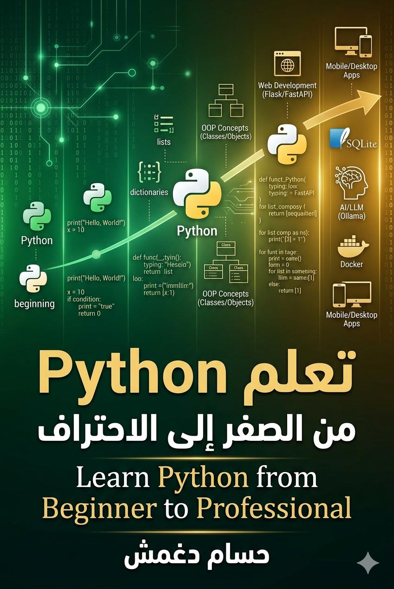

# 🐍 كتاب تعلم Python من الصفر إلى الاحتراف

---

## 📖 غلاف الكتاب

    
    
<strong>تعلم Python من الصفر إلى الاحتراف</strong> تأليف: حسام دغمش

---

## 📚 عن الكتاب

هذا كتاب إلكتروني تفاعلي يهدف إلى تعليم لغة **Python** باللغة العربية من المستوى المبتدئ تماماً إلى المستوى المتقدم، مع أكثر من **200 مثال برمجي** قابل للنسخ والتنفيذ الفوري.

| الفئات | العدد |
|:---|:---:|
| 📚 الفصول | 29 |
| 💻 الأمثلة البرمجية | 200+ |
| 🎯 المشاريع التطبيقية | 5+ |
| 📖 الصفحات | 1500+ |

---

## 📑 محتويات الكتاب

### المستوى الأساسي (الفصول 1-15)

| الفصل | الموضوع |
|:---:|:---|
| 1 | مقدمة في Python |
| 2 | المتغيرات وأنواع البيانات |
| 3 | العمليات الحسابية والمنطقية |
| 4 | السلاسل النصية (Strings) |
| 5 | القوائم (Lists) |
| 6 | الصفوف (Tuples) والمجموعات (Sets) |
| 7 | القواميس (Dictionaries) |
| 8 | جمل التحكم |
| 9 | الدوال (Functions) |
| 10 | البرمجة كائنية التوجه (OOP) |
| 11 | التعامل مع الملفات |
| 12 | معالجة الأخطاء |
| 13 | الوحدات والحزم (Modules & Packages) |
| 14 | البرمجة المتقدمة |
| 15 | مكتبات Python القياسية |

### المستوى المتقدم (الفصول 16-29)

| الفصل | الموضوع |
|:---:|:---|
| 16 | البرمجة الشبكية (Networking) |
| 17 | قواعد البيانات (SQLite) |
| 18 | تطوير الويب (Flask, FastAPI) |
| 19 | علم البيانات الأساسي (NumPy, Pandas) |
| 20 | مشاريع تطبيقية |
| 21 | أفضل الممارسات |
| 22 | نصائح وأدوات |
| 23 | Async/Concurrency في Python |
| 24 | اختبار متقدم (Advanced Testing) |
| 25 | تطوير تطبيقات الموبايل مع Kivy |
| 26 | BeeWare - Python أصلي على كل المنصات |
| 27 | PyInstaller - تحويل Python إلى ملفات تنفيذية |
| 28 | Docker مع Python |
| 29 | الذكاء الاصطناعي المحلي مع Ollama |

---

## ✨ ميزات الكتاب التفاعلية

| الميزة | الوصف |
|:---|:---|
| 🎨 **تصميم عصري** | واجهة جذابة واحترافية |
| 🌙 **وضع مظلم/فاتح** | يناسب جميع الأوقات والتفضيلات |
| 🔍 **بحث سريع** | ابحث عن أي كلمة في الفصول |
| 📋 **نسخ الأكواد** | نسخ أي مثال برمجي بنقرة واحدة |
| 📱 **تصميم متجاوب** | يعمل بشكل مثالي على الجوال والكمبيوتر |
| 💾 **حفظ التقدم** | يتذكر آخر موضع قراءة لك |
| 📊 **شريط تقدم** | يوضح نسبة إنجازك في الكتاب |
| 🖨️ **دعم الطباعة** | يمكن تحويله إلى PDF بجودة عالية |

---

## 🚀 كيفية الاستخدام

### الطريقة 1: مباشرة في المتصفح (الأسهل)

1. حمل ملف `index.html` من هذا المستودع
2. افتحه في أي متصفح حديث (Chrome, Firefox, Edge, Safari)
3. ابدأ القراءة والاستفادة!

### الطريقة 2: عبر GitHub Pages (مباشر)

بعد رفع الملفات، يمكنك الوصول إلى الكتاب عبر الرابط:

# 🐍 كتاب تعلم Python من الصفر إلى الاحتراف

---

## 📖 غلاف الكتاب

    
    
<strong>تعلم Python من الصفر إلى الاحتراف</strong> تأليف: حسام دغمش

---

## 📚 عن الكتاب

هذا كتاب إلكتروني تفاعلي يهدف إلى تعليم لغة **Python** باللغة العربية من المستوى المبتدئ تماماً إلى المستوى المتقدم، مع أكثر من **200 مثال برمجي** قابل للنسخ والتنفيذ الفوري.

| الفئات | العدد |
|:---|:---:|
| 📚 الفصول | 29 |
| 💻 الأمثلة البرمجية | 200+ |
| 🎯 المشاريع التطبيقية | 5+ |
| 📖 الصفحات | 1500+ |

---

## 📑 محتويات الكتاب

### المستوى الأساسي (الفصول 1-15)

| الفصل | الموضوع |
|:---:|:---|
| 1 | مقدمة في Python |
| 2 | المتغيرات وأنواع البيانات |
| 3 | العمليات الحسابية والمنطقية |
| 4 | السلاسل النصية (Strings) |
| 5 | القوائم (Lists) |
| 6 | الصفوف (Tuples) والمجموعات (Sets) |
| 7 | القواميس (Dictionaries) |
| 8 | جمل التحكم |
| 9 | الدوال (Functions) |
| 10 | البرمجة كائنية التوجه (OOP) |
| 11 | التعامل مع الملفات |
| 12 | معالجة الأخطاء |
| 13 | الوحدات والحزم (Modules & Packages) |
| 14 | البرمجة المتقدمة |
| 15 | مكتبات Python القياسية |

### المستوى المتقدم (الفصول 16-29)

| الفصل | الموضوع |
|:---:|:---|
| 16 | البرمجة الشبكية (Networking) |
| 17 | قواعد البيانات (SQLite) |
| 18 | تطوير الويب (Flask, FastAPI) |
| 19 | علم البيانات الأساسي (NumPy, Pandas) |
| 20 | مشاريع تطبيقية |
| 21 | أفضل الممارسات |
| 22 | نصائح وأدوات |
| 23 | Async/Concurrency في Python |
| 24 | اختبار متقدم (Advanced Testing) |
| 25 | تطوير تطبيقات الموبايل مع Kivy |
| 26 | BeeWare - Python أصلي على كل المنصات |
| 27 | PyInstaller - تحويل Python إلى ملفات تنفيذية |
| 28 | Docker مع Python |
| 29 | الذكاء الاصطناعي المحلي مع Ollama |

---

## ✨ ميزات الكتاب التفاعلية

| الميزة | الوصف |
|:---|:---|
| 🎨 **تصميم عصري** | واجهة جذابة واحترافية |
| 🌙 **وضع مظلم/فاتح** | يناسب جميع الأوقات والتفضيلات |
| 🔍 **بحث سريع** | ابحث عن أي كلمة في الفصول |
| 📋 **نسخ الأكواد** | نسخ أي مثال برمجي بنقرة واحدة |
| 📱 **تصميم متجاوب** | يعمل بشكل مثالي على الجوال والكمبيوتر |
| 💾 **حفظ التقدم** | يتذكر آخر موضع قراءة لك |
| 📊 **شريط تقدم** | يوضح نسبة إنجازك في الكتاب |
| 🖨️ **دعم الطباعة** | يمكن تحويله إلى PDF بجودة عالية |

---

## 🚀 كيفية الاستخدام

### الطريقة 1: مباشرة في المتصفح (الأسهل)

1. حمل ملف `index.html` من هذا المستودع
2. افتحه في أي متصفح حديث (Chrome, Firefox, Edge, Safari)
3. ابدأ القراءة والاستفادة!

### الطريقة 2: عبر GitHub Pages (مباشر)

بعد رفع الملفات، يمكنك الوصول إلى الكتاب عبر الرابط:
